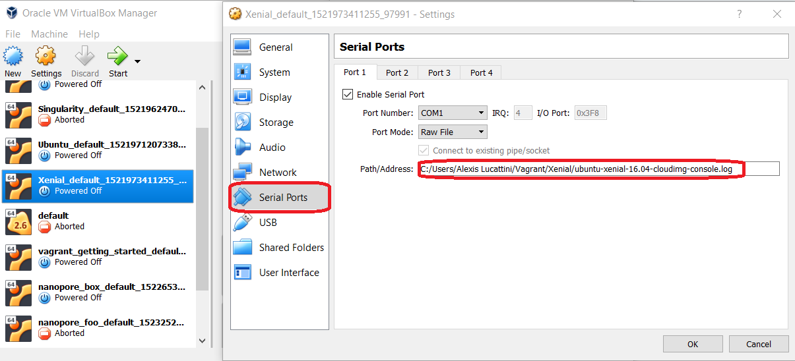

# Setup (15 mins)

## Installing Vagrant

Head to [Vagrant](https://www.vagrantup.com/downloads.html) and follow the instructions.

You will need to log-out and back in again to ensure vagrant is in your path.

.small[Windows 10 users will need to ensure that Hyper-V has been disabled prior to installation]

## Creating a Vagrant Cloud account.

Creating a vagrant cloud account can be done by heading to [Cloud setup](https://app.vagrantup.com/)

---

# Downloading a base box. (5 - 15 mins)

Using Git Bash or Terminal, create a directory such as `~/Vagrant` to store all your boxes in.

Create the directory `~/Vagrant/Xenial` and then enter that directory.

Initialise the VM with the command `vagrant init Ubuntu/Xenial`.

You should see the file 'VagrantFile' now in this folder.

Download and start the VM with the command `vagrant up`.  
.small[This step may take some time depending on internet speed]

---

# SSH into the vagrant box.

Now that the box is up and running, type `vagrant ssh`. 

You should be able to log in. Type `sudo -i`. You should see that you also have full control of the VM.

---

# Exiting the vagrant box.

Exit the vagrant box with the standard `exit` command.   

The vagrant box will continue to  run in the background.  

To shutdown the VM type `vagrant halt` into the terminal.

---

# Packaging the vagrant box.

After much playing with the vagrant box, you are able to export the box as a file and can transfer to any users you desire. 

Simply type the command:  
`vagrant package --output my_modified_xenial.box`.

*Note: This will shutdown the box.*

---

# Exporting the vagrant box to cloud.

With a free account, the most logical way to share vagrant boxes over the internet is

1. Uploading the .box file to a shared cloud-drive of choice.  
2. Linking the box to the vagrant package. 

We will go through the linking step in the next slide.

---

# Linking your vagrant box.

1. Head to your Vagrant Cloud Dashbox and select `New Box`
  + Add a name, and a short description of your box.
  + Click 'Create Box'  
2. Add a version. (`1.0.0`)
  + Add a description  of this version ('Added basics')
  + Click 'Create Version'
  + You should see that  your version is 'unreleased' at this point.
  + Before we release it, click 'Add a provider'  
3. Add a provider
  + Select 'VirtualBox' as the  Provider from dropdown menu.
  + Paste in the share-link to your box.  
4. Release this version of your box.

Users can now  download your box using:  
`vagrant init your_vagrant_username/your_vagrant_boxname`

.small[
1. *OwnCloud links will need the /download suffix.*  
2. *All box links will need to be publicly accessible*
]

---

# Expaanding the potential disk-size.

Vagrant boxes use dynamic storage space but still have defined limits. Often around 10 Gb. 

To increase this, you will first need to install the plugin vagrant-disksize. `vagrant plugin install vagrant-disksize`.

Then open up the vagrant file and add the following just under the `config.vm.box = ...` line.  

`config.disksize.size = '20GB'`  

This will expand your maximum disk usage size to 20 GB.
---

# Known Caveat.

Boxes can sometimes hardcode variables such as the serial port. This can cause errors when running with other users. Try editing the variable below to the appropriate path. 

