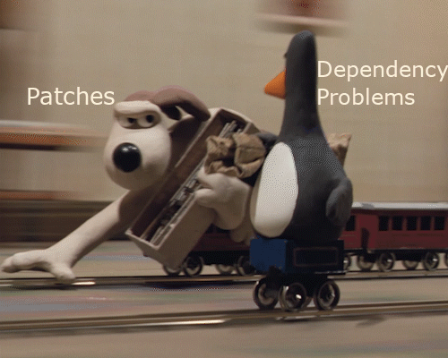

# Introduction
.pull-left[
## Covered:
.baby-bear[
* Building from pre-built containers  
* Installations via a recipe
* Running containers on your HPC  
* Developing module files for containers  
]]
.pull-right[
## Not covered:
.baby-bear[
* Using 
  + 'make'  
  + 'gcc'  
  + 'apt'  
  + 'docker'  
  + 'sbatch'  
]
]

---

# Why Containers?

.center[]

---

# Why Containers
## Reproducible Results

.center[]

---

# Why Containers
## Environment independent

.center[]

---

# Why Containers
## Easily installation

.center[]

---

# Why Containers
## Reduce conflicts
.center[]

???

Without using containers, one must ensure that all modules that may be loaded at once are compatible, leading to a lot of tinkering with code.


---

# Singularity
.pull-left[
.baby-bear[
* HPC friendly
  + No root required for running
  + Reduce security issues<br></br>
* Smaller overhead<br></br>
* Segmented recipes<br></br>
* Can import Docker recipes<br></br>
]
]
.pull-right[
.baby-bear[
* Steep Learning curve<br></br>
* Some system-admin knowledge required
  + apt-get installation methods<br></br>
* Developing technology<br></br>
* Locale Inheritance<br></br>
* Small community<br></br>
]
]

???

 
---

# Environment wrapping
.baby-bear[
+ Containers and HPC scheduling initially can be quite overwhelming.<br></br> 
+ This diagram is not intended to intimidate but for debugging assistance.
]
.center[]

---

# Installation Overview

.center[]

---

# Building a container

.pull-left[
.baby-bear[
+ Choose a base container to start with.<br></br>
+ Bases can be found at [SingularityHub repo](https://singularity-hub.org/collections)<br></br>
+ Or from the [DockerHub repo](https://hub.docker.com/).<br></br>
]
]
.pull-right[
.baby-bear[
+ Use the `%runscript` to specfiy which command to run inside the container.<br></br>
+ Usually prefix with 'exec' and end with `${@}` which represents any trailing parameters<br></br>
]
]


---

# Examples

.pull-left[
## DockerHub
```{bash, eval=FALSE}
$ cat docker.recipe
BootStrap: docker
From: r-base:3.5.1

%runscript
exec R ${@}
```
]
.pull-right[
## SingularityHub
```{bash, eval=FALSE}
$ cat recipe.singularity
BootStrap: shub
From: MPIB/singularity-r:3.5.1

%runscript
exec R ${@}
```
]

---

# Building the container

.pull-left[
## Dockerhub
```{bash, eval=FALSE}
$ sudo singularity build \
  r_from_docker_3.5.2.simg recipe
```
]
.pull-right[
## SingularityHub
```{bash, eval=FALSE}
$ sudo singularity build \
  r_from_shub_3.5.2.simg recipe
```
]
---

# Running the container

With just those two lines we now have containers that can run the R console!<br></br>
```{bash eval=FALSE}
$ singularity run r_from_shub_3.5.2.simg
```

---

# Shell inside the container

.pull-left[
.baby-bear[
**Why shell**<br></br>
Curious to see what's under the hood?  
We can shell into the container using the command below.
Use `exit` to exit the container.  
]
]
.pull-right[
.baby-bear[
**Traversing activity**<br></br>
When inside the container try the following commands.  
`ls /data`  
`ls /home`  
Which one of these worked? What does this mean?
]
]
<br></br>
```{bash, eval=FALSE}
$ singularity shell r_from_shub_3.5.2.simg
```

---

# Write a recipe
.small-code[
```{bash, eval=FALSE}
$ cat singularity_v2.recipe
BootStrap: shub
From: MPIB/singularity-r:3.5.1

%help
To get started with this image, try
singularity run r_from_shub_3.5.1.simg


%post
# Preinstallall the tidyverse and BiocManager for the users
Rscript --vanilla -e 'install.packages("tidyverse")'
Rscript --vanilla -e 'install.packages("BiocManager")'

%runscript
exec R ${@}
```
]

.footnote[
If this script fails for you, please see the next slide before panicking
]

???

The R container is pretty good, but maybe we could give our users a bit of a head-start.   
Using the %post section we’ll preinstall a few packages to get them going.
If this script fails for you, you've done good.

---

# Adding files
.baby-bear[
No CRAN mirror specified?  
No worries, we can add [one](rprofile.site) in using the %files section.
]

.small-code[
```{bash, eval=FALSE}
$ cat singularity_v3.recipe
BootStrap: shub
From: MPIB/singularity-r:3.5.1

%help
...

%files
r_profile.site /usr/local/lib/R/etc/Rprofile.site

%post
Rscript --vanilla -e 'install.packages("tidyverse")'
...


```
]

???


---

# Apps

.baby-bear[
Our container now runs R interactively,  
however, this may not suit the needs of everyone.

* Apps allow users to specify what commands they wish to run.<br></br>
* Apps can also have their own specific:
  + %files
  + %environment
  + %post<br></br>

Just specify with the %app prefix and complete with the app name.
]

???

But say our user just needs the R platform, not the interactive suite? We could create a new container with a new %runscript parameter that use Rscript instead of R. Seems like a waste of a container. So this segues nicely into Apps.

---

# App example

.small-code[
```{bash, eval=FALSE}
$ cat singularity_v4.recipe
BootStrap: shub
From: MPIB/singularity-r:3.5.1

%help
...

%apphelp Rscript
Use container in non-interactive mode
singularity run r_from_shub.3.5.2.simg --no-init-file my_r_script

%apprun Rscript
exec Rscript ${@}

...
%files
%post
%runscript
...

```
]

---

# Environment

Singularity environments can be managed in three ways, with the hierachies as follows.

* exporting variables with the `SINGULARITYENV_` prefix prior to running.
* exporting variables in %post or %apppost
* exporting in %environment or %appenvironment

For examples, please visit the [docs](https://www.sylabs.io/guides/2.5/user-guide/environment_and_metadata.html)


---

# BioContainers

.pull-left[
.baby-bear[
Most common installations, can be much simpler than the previous example shown. <br></br> 
[BiocContainers consortium](https://biocontainers.pro/) hosted by [quay](https://quay.io/search) means often only simple recipes are required.<br></br>
BioContainers are often very compact (6Mb or less!)
]
]
.pull-right[
.small-code[
```{bash, eval=FALSE}
$ cat star_from_quay.2.7.0b.recipe
Bootstrap: docker
From: quay.io/biocontainers/star:2.7.0b--0

%help
Example:
singularity run --bind /data:/data star --help

%runscript
exec STAR "${@}"

%apprun standard
exec STAR "${@}"

%apprun long
exec STARlong "${@}"
```
]
]

???

---

# Container to Module

It would be nice if our user could just run the commands below.
Since
+ Modules more common, no pipeline disruptions
+ User experience with singularity not required.<br></br>

```{bash, eval=FALSE}
module load star/2.7.0
star --help
```

---

# Container to Module

We keep the module short and sweet as summarised below.
We then write a bash wrapper to the bin path which wraps around the container script.

See the template bash wrapper [here](https://gist.githubusercontent.com/alexiswl/6974927ab8da81f1e3dc2222db467486/raw/2ac3ea22e632408f972f557a367d1a67defb5530/templates_bash_wrapper.sh)

```{bash, eval=FALSE}
$ module show star/2.7.0
-------------------------------------------------------------------
$MODULEPATH/star/2.7.0:

conflict         star
prepend-path     PATH $CONTAINER_PATH/star/2.7.0/bin

```

---

# Testing the installation

```{bash, eval=FALSE}
# Load module
module load star/2.7.0
# Run help script on module
STAR --help
# Try running help script through slurm
srun --time=0-00:00:10 STAR --help
```