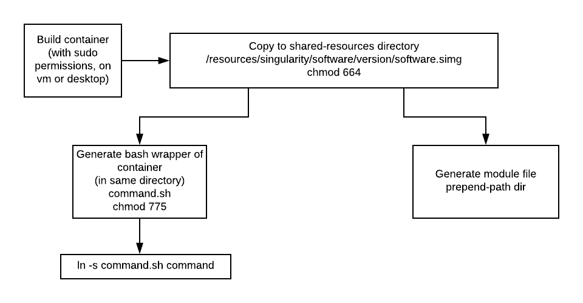

# Introduction

This document provides information for installing and running containers through a HPC. 
It will cover building from pre-built containers, installations via a recipe script, developing module files for your containers and running your containers on a HPC.

{width=250px}


## Why containers?
  + **Reproducible results**
    + Version control
    
  + **Environment independent**
    + Works for me, works for you.
    
  + **Easily installation**
    + No sudo permissions on HPC required!
  
  + **Reduce conflicts between software**
    + Pipeline saviour
    
## Which containers
  + Singularity > Docker
    + HPC friendly (no root required for running)
    + Reduce security issues
    + Smaller overhead
    + Segmented recipes
    + Less community
    + Can import dockerfiles anyways

## Caveats
  + Learning curve
  + Some system-admin knowledge required (apt-get installation methods)
  + Developing technology (some bugs fixed required)
  
# Overview of environment wrapping
Containers and HPC scheduling initially can be quite overwhelming.
This diagram is not intended to intimidate but for debugging assistance.


# Installation Overview



# Building a container

First you will need to choose a base container to start with.
This may be either from the [SingularityHub repo](https://singularity-hub.org/collections) or from the [DockerHub repo](https://hub.docker.com/).

We then use `%runscript` to tell singularity which command to run inside the container. The command is prefix with 'exec' and ends with `${@}` which represents any trailing parameters

### DockerHub example
```{bash, eval=FALSE}
$ cat recipe.docker
BootStrap: docker
From: r-base:3.5.1

%runscript
exec R ${@}
```

### SingularityHub example
```{bash, eval=FALSE}
$ cat recipe.singularity
BootStrap: shub
From: MPIB/singularity-r:3.5.1

%runscript
exec R ${@}
```

Both of these results examples will result in similar environments.

Let's practise building these containers

Note the following will require sudo permissions
```{bash, eval=FALSE}
$ sudo singularity build r_from_shub_3.5.2.simg recipe
$ sudo singularity build r_from_docker_3.5.2.simg recipe
```

### Running the container

With just those two lines we now have containers that can the R console!
```{bash eval=FALSE}
$ singularity run r_from_shub_3.5.2.simg
```

### Shell inside the container

Maybe we're curious to see what's under the hood.
We can shell into the container using the command below,
use `exit` to exit the container.

When inside the container try the following commands.
`ls /data`
`ls /home`
Which one of these worked? What does this mean?
```{bash, eval=FALSE}
$ singularity shell r_from_shub_3.5.2.simg
```

### Specify a help script
Tell people how to your container

```{bash, eval=FALSE}
$ cat recipe.singularity
BootStrap: shub
From: MPIB/singularity-r:3.5.1

%help
To get started with this image, try
singularity run --bind /data:/data r_from_shub_3.5.1.simg

$ singularity help r_from_shub_3.5.1.simg

To get started with this image, try
singularity run r_from_shub_3.5.1.simg

%runscript
exec R ${@}
```

### Specify an installation script
The R container is pretty good, but maybe we could give our users a bit of a head-start.
Using the %post section we'll preinstall a few packages to get them going.
```{bash, eval=FALSE}
$ cat recipe.singularity
BootStrap: shub
From: MPIB/singularity-r:3.5.1

%help
To get started with this image, try
singularity run r_from_shub_3.5.1.simg


%post
Rscript --vanilla -e 'install.packages("tidyverse")'
Rscript --vanilla -e 'install.packages("BiocManager")'

%runscript
exec R ${@}

$ sudo singularity build r_from_shub_3.5.1.simg recipe
```

Oh dear, it appears we don't have a CRAN mirror. We can add one in using %files section and ensure it's there for all users.

First we'll create a local R script that we can add into the container in the appropriate spot.

```{bash, eval=FALSE}
$ cat r_profile.site
# Set CRAN and BioC
local({

# Get standard repos
r <- getOption("repos")
# Get local CRAN mirror
r["CRAN"] <- "https://cran.ms.unimelb.edu.au"


# Add biocmanager repos
if ("BiocManager" %in% rownames(as.data.frame(utils::installed.packages()))){
        r <- c(r, BiocManager::repositories())
}

# Set to options
options(repos = r)
})
```

Now place this file in the appropriate location with %files. Note you may wish to shell into the old container to see where the $R_HOME directory is.

```{bash, eval=FALSE}
$ cat recipe.singularity
BootStrap: shub
From: MPIB/singularity-r:3.5.1

%help
To get started with this image, try
singularity run r_from_shub_3.5.1.simg

%files
r_profile.site /usr/local/lib/R/etc/Rprofile.site

%post
Rscript --vanilla -e 'install.packages("tidyverse")'
Rscript --vanilla -e 'install.packages("BiocManager")'

%runscript
exec R ${@}

$ sudo singularity build r_from_shub_3.5.1.simg recipe
```

Now users can start using your R container straight away.

This all very handy... but what if the user already has a script and doesn't need the interactive console.

### Introducing apps
Apps allow users to specify what commands they wish to run, handy when a package may contain more than one command.
One can also specify files, environments and installations all specific to one app. Let's complete our R environment with apps. Checkout the STAR command in the BiocContainers chapter below. for additional apps too.

```{bash, eval=FALSE}
$ cat recipe.singularity
BootStrap: shub
From: MPIB/singularity-r:3.5.1

%help
To get started with this image, try
singularity run r_from_shub_3.5.1.simg

%apphelp Rscript
Use container in non-interactive mode
singularity run r_from_shub.3.5.2.simg --no-init-file my_r_script

%apprun Rscript
exec Rscript ${@}

%files
r_profile.site /usr/local/lib/R/etc/Rprofile.site

%post
Rscript --vanilla -e 'install.packages("tidyverse")'
Rscript --vanilla -e 'install.packages("BiocManager")'

%runscript
exec R ${@}

$ sudo singularity build r_from_shub_3.5.1.simg recipe
```

### BioContainers

That was an effort and a half! Fortunately, the great thing about containers is that they're transferrable across the globe!
The [BioContainers consortium](https://quay.io/repository/) provides succinct containers to run almost every bio container one can think of. We just need to make a small wrapper around them. 

Check out this star image and recipe

```{bash, eval=FALSE}
$ cat star_from_quay.recipe
Bootstrap: docker
From: quay.io/biocontainers/star:2.7.0b--0

%help
Example:
singularity run --bind /data:/data star --help


%labels
MAINTAINER Alexis Lucattini
VERSION 2.7.0b
CONDA_VERSION 3

%runscript
exec STAR "${@}"

%apprun standard
exec STAR "${@}"

%apprun long
exec STARlong "${@}"
```

```{bash eval=FALSE}
$ sudo singularity build star_from_quay.simg star_from_quay.recipe
$ singularity help star_from_quay.simg

Example:
singularity run --bind /data:/data star --help

$ singularity apps star_from_quay.simg
long
standard

$ singularity run --app long star_from_quay.simg
```

# Modularise a container
It would be nice if we could just do,
```{bash, eval=FALSE}
module load star/2.7.0
star --help
```

It would allow other users not to have an extensive knowledge of singularity to run,
it also means module based pipelines do not need to be greatly adjusted in order to move from standard shell based scripts to containers.

Unforutantely this isn't that straight forward, we go through the module creation in the next few steps.

## Keep the module short and sweet.

But always add a what-is and a module help statement to make the software easy to use as possible.

```{bash, eval=FALSE}
$ module show centrifuge
-------------------------------------------------------------------
/data/Bioinfo/bioinfo-resources/modules/centrifuge/1.0.4:

conflict         centrifuge
prepend-path     PATH /data/Bioinfo/bioinfo-resources/apps/singularity/centrifuge/1.0.4/bin
-------------------------------------------------------------------
```

## What's in the bin path?
The bin path contains the name of the software application which is soft-linked to the bash script that runs the application

## Why use a bash wrapper?
Ideally we would have used the set-alias command in the module, however, srun won't have a bar of it as it inherits just the environment variables, not the surrounding functions from the batch script. To work-around this, we create a bash wrapper which runs the singularity command.

## A bash wrapper example.
The following is an overcomplicated example that can be found in the singularity template. The wrapper allows the user to create env variables that just print the output or the current environment to stderr.
The bash wrapper also performs checks for bind paths (that they exist), ensures that the container exists, and that the apps within the container to be run also exist.

Below is an example of the bash installation. 

```{bash, eval=FALSE}
#!/bin/bash

# Write echo to stderr
echoerr() { echo "$@" 1>&2; }

# Global variables (Debugger determined by DRY_RUN_CENTRIFUGE env variable)
## Name of software (for container, this may be different to the command)
SOFTWARE="centrifuge"
## Software version
VERSION="1.0.4"
## WHAT Bind paths are to be set by default
BIND_PATHS_ARRAY=( /data /Databases )
## Would we like a clean environment 0: No, 1: Yes
CLEAN_ENV=1
## Do we need a specific app to run
APP=""

# Local variables (Standard between images)
HERE=$(dirname "${BASH_SOURCE[0]}")
CONTAINER_DIR=$(dirname ${HERE})
IMAGE=${CONTAINER_DIR}/images/${SOFTWARE}_${VERSION}.simg
SOFTWARE_UPPER=${SOFTWARE^^}
# Initialise command opts
COMMAND_OPTS=""

# Check for clean env
if [[ "${CLEAN_ENV}" == "1" ]]; then
        COMMAND_OPTS="${COMMAND_OPTS} --cleanenv"
elif [[ "${CLEAN_ENV}" == "0" ]]; then
        :
else
        echoerr "Clean env toggle not specified correctly, must be between zero or one, not ${CLEAN_ENV}"
        exit 1
fi

# Check debugger
if [[ -v DRY_RUN_${SOFTWARE_UPPER} ]]; then
        echoerr "This will be a dry-run of the software"
        DRY_RUN=$(eval 'echo "${DRY_RUN_'"${SOFTWARE_UPPER}"'}"')
        echoerr "Verbosity level has been set at ${DRY_RUN}"
else
        DRY_RUN=0
fi

# Check image exists
if [[ -f ${IMAGE} ]]; then
       :
else
        echoerr "Cannot find image. ${IMAGE} does not exist"
        exit 1
fi

# Check / add APP
if [[ ! -z ${APP} ]]; then
        # Evaulate grep
        grep -q ${APP} <(singularity apps ${IMAGE})
        # Check app is inside by using grep exit code
        if [[ "$?" == 0 ]]; then
                COMMAND_OPTS="${COMMAND_OPTS} --app ${APP}"
        else
                echoerr "Could not find app ${APP} in image ${IMAGE}"
                exit 1
        fi
fi

# Add in bind_paths
BIND_PATHS_STR=""
for BIND_PATH in "${BIND_PATHS_ARRAY[@]}"; do
        # Check path exists in filesystem before binding
        if [[ ! -d "${BIND_PATH}" ]]; then
                echoerr "Could not bind path ${BIND_PATH}. Exiting"
                exit 1
        else
                BIND_PATHS_STR="${BIND_PATHS_STR} --bind ${BIND_PATH}:${BIND_PATH}"
        fi
done

# Do we need to unset the xdgruntimedir
if [[ -v XDG_RUNTIME_DIR && ! -z "$XDG_RUNTIME_DIR" ]]; then
        unset XDG_RUNTIME_DIR
fi

# Merge as command options
if [[ ! -z ${BIND_PATHS_STR} ]]; then
        COMMAND_OPTS="${COMMAND_OPTS} ${BIND_PATHS_STR}"
fi

# Set command
COMMAND="singularity run ${COMMAND_OPTS} ${IMAGE} ${@}"

# Would you like to see the environment we're running it in
if [[ "${DRY_RUN}" == "2" ]]; then
        echoerr ""
        echoerr "### Printing out current environment ###"
        printenv 2>&1
        echoerr "### Completed printing of the environment ###"
        echoerr ""
fi

# Would you like to printout the command we're running
# Or run it instead?
if [[ ! "${DRY_RUN}" == "0" ]]; then
        echoerr ""
        echoerr "### Would have run command ###"
        echoerr "${COMMAND}"
        echoerr "### Completed printing of the command ###"
        echoerr ""
else
        # Run command
        eval ${COMMAND}
fi


# Check / add APP
if [[ ! -z ${APP} ]]; then
        # Evaulate grep
        grep -q ${APP} <(singularity apps ${IMAGE})
        # Check app is inside by using grep exit code
        if [[ "$?" == 0 ]]; then
                APP="--app ${APP}"
        else
                echoerr "Could not find app ${APP} in image ${IMAGE}"
                exit 1
        fi
fi

# Add in bind_paths
BIND_PATHS_STR=""
for BIND_PATH in "${BIND_PATHS_ARRAY[@]}"; do
        # Check path exists in filesystem before binding
        if [[ ! -d "${BIND_PATH}" ]]; then
                echoerr "Could not bind path ${BIND_PATH}. Exiting"
                exit 1
        elif [[ ! -v BIND_PATHS_STR || -z ${BIND_PATHS_STR} ]]; then
                BIND_PATHS_STR="--bind ${BIND_PATH}:${BIND_PATH}"
        else
                BIND_PATHS_STR="${BIND_PATHS_STR} --bind ${BIND_PATH}:${BIND_PATH}"
        fi
done

# Do we need to bind the xdg runtime dir
if [[ -v XDG_RUNTIME_DIR && ! -z "$XDG_RUNTIME_DIR" ]]; then
        BIND_PATHS_STR="${BIND_PATHS_STR} --bind $XDG_RUNTIME_DIR:$XDG_RUNTIME_DIR"
fi

# Set command
COMMAND="singularity run ${APP} ${BIND_PATHS_STR} ${CLEAN_ENV} ${IMAGE} ${@}"

# Would you like to see the environment we're running it in
if [[ "${DRY_RUN}" == "2" ]]; then
        echoerr "Printing out current environment"
        printenv 2>&1
fi

# Would you like to printout the command we're running
# Or run it instead?
if [[ ! "${DRY_RUN}" == "0" ]]; then
        echoerr "Would have run command ${COMMAND}"
else
        # Run command
        eval ${COMMAND}
fi
```

# Reducing repetition
See the following [gist]
(https://gist.github.com/alexiswl/6974927ab8da81f1e3dc2222db467486) for generating bash wrappers, modules and singularity recipes from biocontainers with just a yaml file.

# Testing an overall Installation
```{bash, eval=FALSE}
# Load module
module load centrifuge/1.0.4
# Run help script on module
centrifuge --help
# Try running help script through slurm
srun --time=0-00:00:10 centrifuge --help
```

