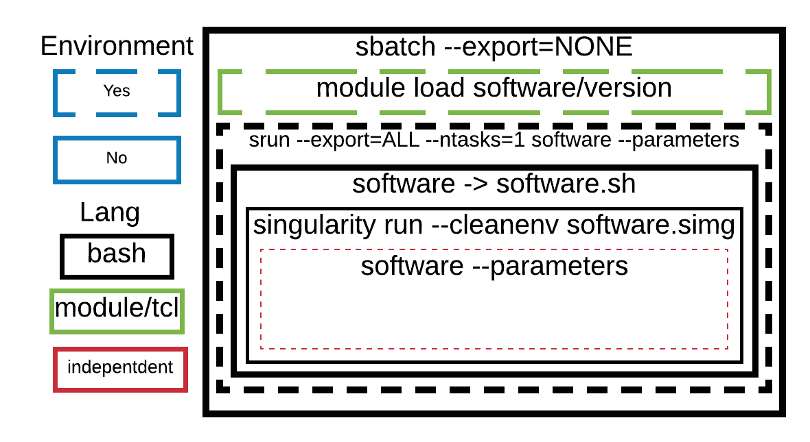
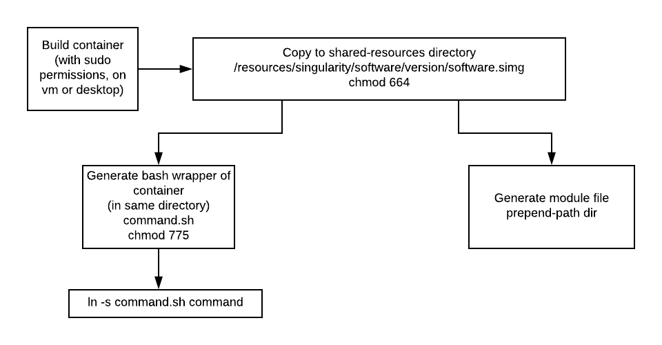

# Introduction

This document provides information for installing and running containers through a HPC. 
It will cover building from pre-built containers, installations via a recipe script, developing module files for your containers and running your containers on a HPC.


## Why containers?
  + Reproducible results
    + Version control
  + Environment independent
    + Works for me, works for you.
  + Easily installation
    
## Which containers
  + Singularity > Docker
    + HPC friendly (no root required for running)
    + Reduce security issues
    + Smaller overhead
    + Segmented recipes
    + Less community
    + Can import dockerfiles anyways

## Caveats
  + Learning curve
  + Some system-admin knowledge required (apt-get installation methods)
  + Developing technology (some bugs fixed required)
  
# Overview of environment wrapping
Containers and HPC scheduling initially can be quite overwhelming.
This diagram is not intended to intimidate but for debugging assistance.



# Installation Overview



# Building a container

First you will need to choose a base container to start with.
This may be either from the [SingularityHub repo](https://singularity-hub.org/collections) or from the [DockerHub repo](https://hub.docker.com/).

We then use `%runscript` to tell singularity which command to run inside the container. The command is prefix with 'exec' and ends with `${@}` which represents any trailing parameters

### DockerHub example
```{bash, eval=FALSE}
$ cat recipe.docker
BootStrap: docker
From: r-base:3.5.1

%runscript
exec R ${@}
```

### SingularityHub example
```{bash, eval=FALSE}
$ cat recipe.singularity
BootStrap: shub
From: MPIB/singularity-r:3.5.1

%runscript
exec R ${@}
```

Both of these results examples will result in similar environments.

Let's practise building these containers

Note the following will require sudo permissions
```{bash, eval=FALSE}
$ sudo singularity build r_from_shub_3.5.2.simg recipe
$ sudo singularity build r_from_docker_3.5.2.simg recipe
```

### Running the container

With just those two lines we now have containers that can the R console!
```{bash eval=FALSE}
$ singularity run r_from_shub_3.5.2.simg
```

### Shell inside the container

Maybe we're curious to see what's under the hood.
We can shell into the container using the command below,
use `exit` to exit the container.

When inside the container try the following commands.
`ls /data`
`ls /home`
Which one of these worked? What does this mean?
```{bash, eval=FALSE}
$ singularity shell r_from_shub_3.5.2.simg
```

### Specify a help script
Tell people how to your container

```{bash, eval=FALSE}
$ cat recipe.singularity
BootStrap: shub
From: MPIB/singularity-r:3.5.1

%help
To get started with this image, try
singularity run --bind /data:/data r_from_shub_3.5.1.simg

$ singularity help r_from_shub_3.5.1.simg

To get started with this image, try
singularity run r_from_shub_3.5.1.simg

%runscript
exec R ${@}
```

### Specify an installation script
The R container is pretty good, but maybe we could give our users a bit of a head-start.
Using the %post section we'll preinstall a few packages to get them going.
```{bash, eval=FALSE}
$ cat recipe.singularity
BootStrap: shub
From: MPIB/singularity-r:3.5.1

%help
To get started with this image, try
singularity run r_from_shub_3.5.1.simg


%post
Rscript --vanilla -e 'install.packages("tidyverse")'
Rscript --vanilla -e 'install.packages("BiocManager")'

%runscript
exec R ${@}

$ sudo singularity build r_from_shub_3.5.1.simg recipe
```

Oh dear, it appears we don't have a CRAN mirror. We can add one in using %files section and ensure it's there for all users.

First we'll create a local R script that we can add into the container in the appropriate spot.

```{bash, eval=FALSE}
$ cat r_profile.site

TODO Update
# Set global options
## Set cairo for plots in headless mode
options(bitmapType='cairo')

# Set repositories
r <- getOption("repos")
r["CRAN"] <- "https://cran.ms.unimelb.edu.au"

# Add biocmanager repos
if ("BiocManager" %in% rownames(as.data.frame(utils::installed.packages()))){
        r <- c(r, BiocManager::repositories())
}
```

Now place this file in the appropriate location with %files. Note you may wish to shell into the old container to see where the $R_HOME directory is.

```{bash, eval=FALSE}
$ cat recipe.singularity
BootStrap: shub
From: MPIB/singularity-r:3.5.1

%help
To get started with this image, try
singularity run r_from_shub_3.5.1.simg

%files
r_profile.site /usr/local/lib/R/etc/Rprofile.site

%post
Rscript --vanilla -e 'install.packages("tidyverse")'
Rscript --vanilla -e 'install.packages("BiocManager")'

%runscript
exec R ${@}

$ sudo singularity build r_from_shub_3.5.1.simg recipe
```

Now users can start using your R container straight away.

This all very handy... but what if the user already has a script and doesn't need the interactive console.

### Introducing apps
Apps allow users to specify what commands they wish to run, handy when a package may contain more than one command.
One can also specify files, 

# BioContainers

That was an effort and a half! Fortunately, the great thing about containers is that they're transferrable across the globe!
The [BioContainers consortium](https://quay.io/repository/) provides succinct containers to run almost every bio container one can think of. We just need to make a small wrapper around them. 

Check out this star image and recipe

```{bash, eval=FALSE}
$ cat star_from_quay.recipe
Bootstrap: docker
From: quay.io/biocontainers/star:2.7.0b--0

%help
Example:
singularity run --bind /data:/data star --help


%labels
MAINTAINER Alexis Lucattini
VERSION 2.7.0b
CONDA_VERSION 3

%runscript
exec STAR "${@}"

%apprun standard
exec STAR "${@}"

%apprun long
exec STARlong "${@}"
```

```{bash eval=FALSE}
$ sudo singularity build star_from_quay.simg star_from_quay.recipe
$ singularity help star_from_quay.simg

Example:
singularity run --bind /data:/data star --help

$ singularity apps star_from_quay.simg
long
standard

$ singularity run --app long star_from_quay.simg
```

# Modularise a container
It would be nice if we could just do,
```{bash, eval=FALSE}
module load star/2.7.0
star --help
```

It would allow other users not to have an extensive knowledge of singularity to run,
it also means module based pipelines do not need to be greatly adjusted in order to move from standard shell based scripts to containers.

Unforutantely this isn't that straight forward, we go through the module creation in the next few steps.

## Keep the module short and sweet.


## Use a bash wrapper
Ideally we would have used the set-alias command in the module, however, srun won't have a bar of it as it inherits just the environment variables, not the surrounding functions from the batch script. To work-around this, we create a bash wrapper which runs the singularity command.

## Testing an overall Installation
```{bash, eval=FALSE}
# Load module
module load software/version
# Run help script on module
software --help
# Try running help script through slurm
srun --time=0-00:00:10 software --help
```

## 
