## Beyond Short Reads

.pull-left[
.large[**Benefits**]
* Long-range haplotyping.
* Methylation with single-molecule level sequencing.
* Scaffolding and genome assembly
* Resolving of large structural variations
]

.pull-right[
.large[**Platforms**]
* ONT 
* PacBio 
* 10X Genomics *
]


???

Notes:
What are the benefits of long reads.
With short read sequencing, haplotyping information can be conveyed as long as there's no homogeneity for 300 bps. This often means that a SNP on one exon cannot be determined to be linked to a SNP on another exon for a given individual.
Both ONT and PacBio offer single-molecule sequencing, the DNA is not amplified prior to entering the flowcell meaning additional modifications such as methylation can be detected with high coverage.
More commonly long-reads are known for resolving scaffolds for genome assembly. Short-reads simply cannot overcome repeat regions longer than their read-length.

---

# Sample Prep requirements

.pull-left[
.baby-bear[
* Molarity != Concentration
* Avoid spin-column base extraction
* Remove impurities
* Additional clean-ups may be needed
]
]

.pull-right[
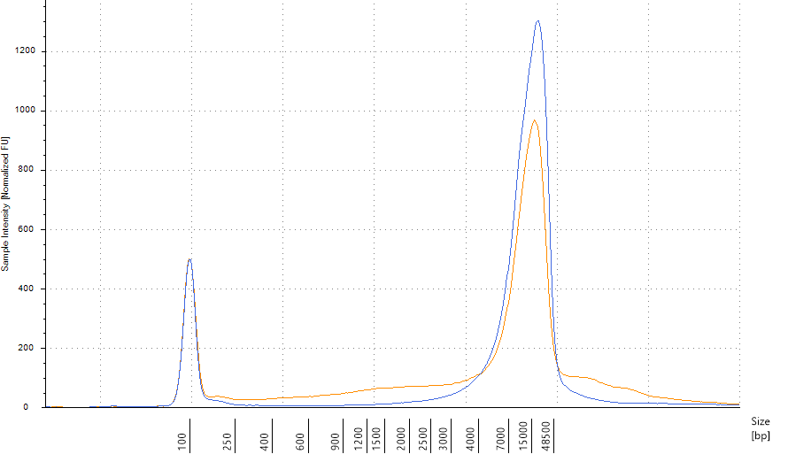
]

???

If you put in crap you will get out crap. Long-read sequencing technology can still process short-reads without fail however this will cause issues with your yield and your base n50.

---

class: long-slide

## Bioinformatics is a bottleneck

* Novel file types 
  + multi-fast5s
  + unaligned BAMs<br></br>
* Many ways to do one thing, benchmarking needed.<br></br>
* Getting help and resources, community still in development.<br></br>
* Denovo assemblies have always been really hard.<br></br>

???

Notes:

Bioinformatics seems to be a bit of an afterthought.
Raw data off each of the machines comes in a different format, meaning bioinformatics algorithms often need to be built from the ground up.
Denovo assemblies will remain really hard as labs try to complete tasks in the most cost-efficient way.

---

class: long-slide

## New methods for standard tasks
.pull-left[
.baby-bear[
**Basecalling**
* Compressed Signal Data
* Local alignments

**Data QC**
* Read length, yields, read quality
* Fastq *indicitive* of read quality.
]
]
.pull-right[
.baby-bear[
**Adapter trimming**
* Nanopore reads have adapters too.
* PacBio reads can be one sequence repeated many times.

**Alignment**
* Different parameter settings required.
]
]

???

Class: ONT, PacBio

Notes: 

While the standard fastq format is still used, getting to fastqs is not trivial. For ONT, this involves running digital signal data through an RNN to convert into sequencing values. QC values are no longer using interop files or Q30 scores, but we want to look at read length, the yield of the data and the sequencing quality, which can be much more varied when using long-read sequencing platforms.

---

class: long-slide

# Minimap2

* Current gold-standard aligner for ONT and PacBio genomic data.
* Make sure the index is an 'ont-index' or 'pacbio-index' when generating an index file.
* Alignments come with CS-string.

.pull-left[
[GitHub](https://github.com/lh3/minimap2)
]
.pull-right[
[GitHub Guide](https://github.com/lh3/minimap2#users-guide)
]

???

Minimap2 is the standard aligner for ONT and PacBio genomic data.
It can also be used with short-reads as its significantly faster than bwa but seems to not be as impressive just yet.

---

class: long-slide

# The CS tag and MD tag
.pull-left[
.baby-bear[
* CS tag - verbose version of MD tag
  + Easier for parsing.
  + Relatively new.
  + MD tag still required for some parsers.
    + Pipe through `samtools calmd` prior to sorting.
]
]
.pull-right[
.baby-bear[
* CS tag example:
  + `:6-ata:10+gtc:4*at:3`
  + `:[0-9]+ is an identical block`
  + '-[ACTG]+ is a deletion`
  + '+[ACTG]+ is an insersion
  + '*XY' is a substitution with base X subsituted for base y.
]
]

???

CS tag is an extremely useful output.

---

class: ont-slide

# Nanopore sequencing

[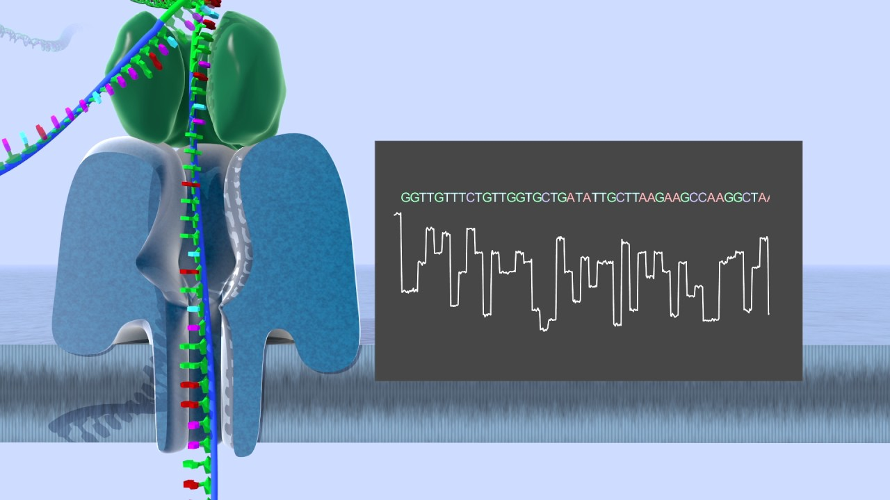](https://www.youtube.com/watch?v=GUb1TZvMWsw)

???

DNA molecules are negatively charged, the DNA passes through a positively charged membrane and this results in change in current across the channel. Different nucleotides are different sizes and this results in difference changes in current levels. Any given current state is not the state of a single nucleotide but of around 5-6 nucleotides in a given pore at a given time, this leads to some complexion about determining a given sequence of bases.

---

class: ont-slide

## Nanopore Sequencing - PMI

.pull-left[
**Technical**
* Very long sequencing reads
* Single-molecule
* Real-time
* Portable
* Accuracy ~= 85-95%
* Yields ~= 20 - 100 Gb  
]

.pull-right[
**Financial**
* Minimal start-up cost
* Cheap for small uses of data
* Relatively expensive per base<br></br>

]

???

Yields and accuracies are extremely sample dependent

---

class: ont-slide

## Basecalling methods
### GPU & CPU.
* GPUs much faster. .small[Guppy 3.1.5 is the current basecalling version]

* Different algorithms give slightly different results.

* .small[Check out Ryan Wick's [base-calling comparison repo](https://github.com/rrwick/Basecalling-comparison)]


???

Not just the algorithm, but the training data it a has been exposed to. We often see that the quality of human data to be a bit higher than other data sets.

---

class: ont-slide

## WUB
* Software package repository from ONT.
* Similar to pysam API.
* Handy plotting tools.

.pull-left[
[GitHub](https://www.github.com/nanoporetech/wub)
]
.pull-right[
[Docs](https://wub.readthedocs.io/en/latest/)
]

???

The wub package contains a large range of plotting tools,  
for nanopore sequencing. 

Some of the plots aren't perfect but everything comes out in a picklable.
These can be easily repimported into python and be re-plotted using the matplotlib or seaborn modules. This way you can also retitle or recaption the plot as needed

---

class: ont-slide

## WUB cont.

.pull-left[

]
.pull-right[


]

???

We've seen that the mapping rates can vary between sample types.
Note the difference between the identity and accuracy.


---

class: ont-slide

## NanoPlot

.pull-left[
.baby-bear[
* Plot run metrics for a MinION run
* [Repo on GitHub](https://github.com/wdecoster/NanoPlot)
* Also see 
  + NanoComp
  + NanoStat
  + NanoFilt
  + NanoLyse
]
]

.pull-right[

]

???

Nanoplot is well supported and can generate alignment plots, plots of fastq scores, yield plots over time. Yield plots over time can show if our sequencing pores have  been contaminated.

---

class: ont-slide

## Porechop, Filtlong, Unicycler

Ryan Wick's repos set for:
* [Demultiplexing / Trimming Adapters](https://github.com/rrwick/porechop)<br></br>
* [Removing poor quality reads](https://github.com/rrwick/filtlong)<br></br>
* [Generating Circular-hybrid assemblies](https://github.com/rrwick/unicycler)<br></br>

???

Ryan Wick from Bio21 has also generated many easy-to-run nanopore qc programs. Nanopore reads like all other sequencing reads have adapters, so please make sure you trim them prior to generating your assemblies.

---

class: ont-slide

# Nanopolish

Jared T. Simpson's [nanopolish](https://github.com/jts/nanopolish) uses signal-level (fast5) data to:
* Detecting methylation
* Calling SNP level variants
* Polishing genomes through consensus

???

While fast5 data is clunky heavy and not user friendly, this doesn't mean you should throw it away, the squiggle information can be used in downstream information for methylation calling and polishing of alignments.

---

class: ont-slide

# Tombo

**ONT's methylation caller.**

* Provides output of regions of significance
* Can be captured as a 'wiggle' file to be viewed in a genome browser.

.pull-left[
[GitHub](https://github.com/nanoporetech/tombo)
]
.pull-right[
[Docs](https://nanoporetech.github.io/tombo/tutorials.html)
]

???


---

class: ont-slide

## Haplotyping-methylation combo

.center[
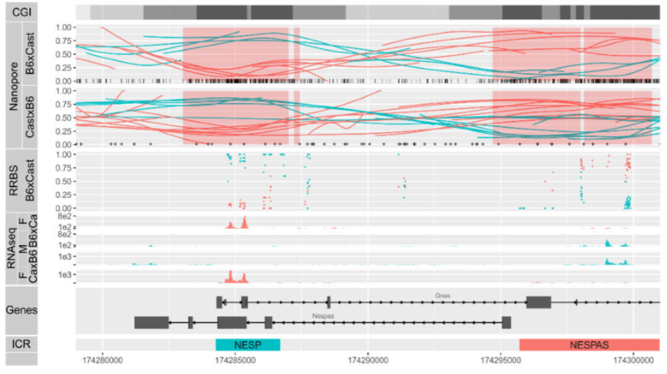
]

.pull-left[
[NAR Paper](https://academic.oup.com/nar/article/47/8/e46/5356940)
]
.pull-right[
[Scott's GitHub Haplotype-Methylome Repo](https://github.com/scottgigante/haplotyped-methylome)
]

???

NANOPORE SPECIFIC

---

class: ont-slide

## AGRF PromethION in focus

Kit-9, sample sensitive, great N50!

.pull-left[

]
.pull-right[

]

---

class: ont-slide

## Some tutorial references

[Tim Kahlke - Toast 2018](https://github.com/timkahlke/toast2018)  
VM based tutorial. Covers QC to methylation to assembly.


[Hadrien Gourle](https://github.com/HadrienG/tutorials/blob/master/docs/nanopore.md)  
Simple fastq to assembly notebook.

???

These linkes are a little old but the data application is still relevant. File input is now close to multi-fast5s

---

class: pacbio-slide

# Pacific Biosciences

[](https://www.youtube.com/watch?v=WMZmG00uhwU&feature=youtu.be)

???

Greater maturity in bioinformatics components. Much of what needs to be done can be done via the smrtlink.
Read number restricted by the number of wells - rather than the amount of sequencing. Data comes out as a really large movie that is then converted to unaligned bam files.
Provide estimates of sequencing length and yield from slides. 

---

class: pacbio-slide

# PacBio - PMI

.pull-left[
.baby-bear[
**Technical**
* Single-molecule
* Sequence-by-replication approach
* Long-reads with high consensus.
* Well-supported bioinformatics
* Finite limit of number-of-molecules.
]
]

.pull-right[
.baby-bear[
**Outputs**
* Output:
  + 10-25 Gbs Amplicon
  + 5-10 Gbs gDNA - n50 10-15Kb<br></br>
**Financial**
* Large-start up cost.
* Relatively expensive per base
]
]

???

The pacbio currently provides a comparable level of throughput to a MinION run but has benefits of having an improved error-rate and a reduction in systematic bias.

---

class: pacbio-slide

# Introduction to SMRTLINK

Bioinformatics at a click-of-a-button!
* Easy stand-alone workflows 
  + cover much of the capability of the device.
  + runs scatter-gather workflows across an HPC
* BAM to CSS.
* SV Calling
* De novo Assembly.
* SNP and INDEL calling on long-range amplicons.

???

Our SMRT-LINK runs on a singularity container, an is an on-demand device.
So only running when we need it!
SMRTLINK and its associated command-line version offer scatter-gather algorithms for each of the different services that we offer. I plan to put a link up on a mini-tutorial of how to set up your own SMRTLINK portal.

---

class: pacbio-slide

# Subread vs CCS Read 

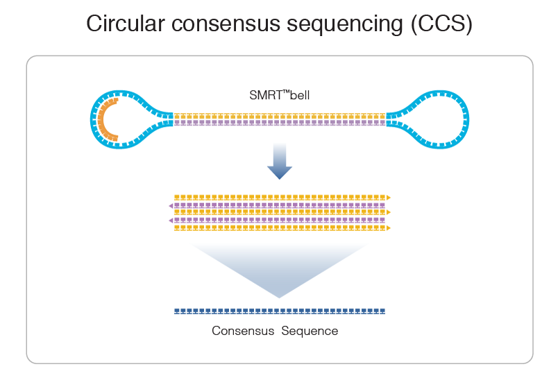

???

The subread contains the smrtbell adapters, converting re-sequenced reads into a concensus single read. 
This increases the accuracy in the read with every additional cycle. Often with genomic DNA, only one cycle is completed. There exists a trade-off between accuracy and length.

Lima is a PacBio developed algorithm for converting subreads into concensus reads.

---

class: pacbio-slide

# PacBio IsoSeq

.pull-left[
+ Full length transcripts.
+ High-consensus rates.
+ Well defined bioinformatics workflows.
+ Complex normalisation methods - pre-QC.
]
.pull-right[
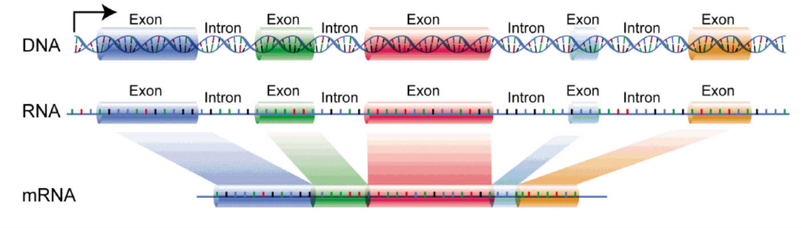
]

???

Utilisation of CCS, full-length transcriptome. Goes through many times allowing for full assembly. Provide a picture of an entire gene for this slide.
Find short read comparison. Exon proportions slide to place in.

---

class: pacbio-slide

# SV Calling with PacBio

.pull-left[
* PacBio supported pipeline is pbsv
  + available in SMRTlink
  + Scalable
* Very low FDR
* Polished breakpoints
]
.pull-right[
* Other community-developed pipelines include:
  + [sniffles](https://github.com/fritzsedlazeck/Sniffles
)
  + [smrtsv2](https://github.com/EichlerLab/smrtsv2
)
* Both also compatible with ONT data.
]

???

Easy work with SMRTLINK but can use community pipelines as well.

---

class: pacbio-slide

# Targeted Sequencing with PacBio

.pull-left[
**Uses:**
* highly-polymorphic regions (HLA)
* phasing
* structural variation
]

.pull-right[
.baby-bear[
**Bioinformatics:**
* Convert to CCS
* Cluster-recluster approach
  + Sort amplicons.
  + Recluster within (Phasing)
  + Build phasing consensus
]
]

???

LAA amplicons can resolve haplotyping information and assembly of small important regions. Reducing the cost of sequencing yield whilst also increasing coverage of the important region.

---

class: long-slide

# Denovo Assembly

.pull-left[
.baby-bear[
**Four assemblers to watch**
* [Canu](https://github.com/marbl/canu)
* [Flye](https://github.com/fenderglass/Flye)
* [wtdbg2 (colloquially prnounced called wobbly2)](https://github.com/ruanjue/wtdbg2)
* [Falcon](https://github.com/PacificBiosciences/pb-assembly)
]
]

.pull-right[
.baby-bear[
* Each are derivatives from one of two methodologies.
* Two main approaches are:
  + Overlap-layout-consensus
  + kmer-based approach
* Some can take a hybrid-approach to assembly.
]
]

???

Denovo assemblies will always be very hard, we'll go through why very soon. Here are four of the most-popular approaches, each come with pros and cons, trading off speed for accuracy and user-friend for customisable. Some allow a hybrid approach meaning more accurate short-reads can be used for 'polishing'

---

class: long-slide

# Assembly lingo
.small[
* k-mer:
  + A sequence of length k.<br><br>
* Node:
  + A short sequence or k-mer within the assembly that can be linked to other sequences.<br><br>
* Edges:
  + A link between two sequences that have evidence of overlap.<br><br>
* Graphs:
  + A visual representation of the sequence using edges and nodes.<br><br>
]

---

class: long-slide

# Assembly lingo 2

.pull-left[
* Contig:
  .baby-bear[
  + An unambiguous* contiguous assembled sequence of the genome.
  ]<br><br>
* Scaffold:
  .baby-bear[
  + A collection of contigs with known orientation.
  ]
]
.pull-right[
.center[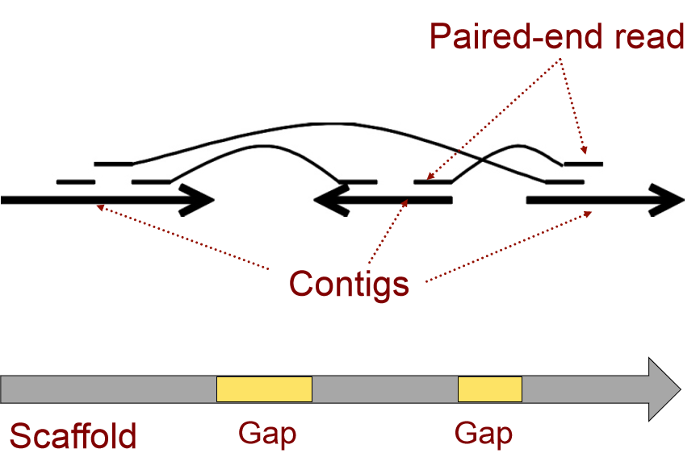]
.tiny[Image credit [Torsten Seeman](http://bioinformatics.org.au/ws14/wp-content/uploads/ws14/sites/5/2014/07/Torsten-Seemann_presentation.pdf)]
]


---

class: long-slide

# Expectations vs Realities
.center[
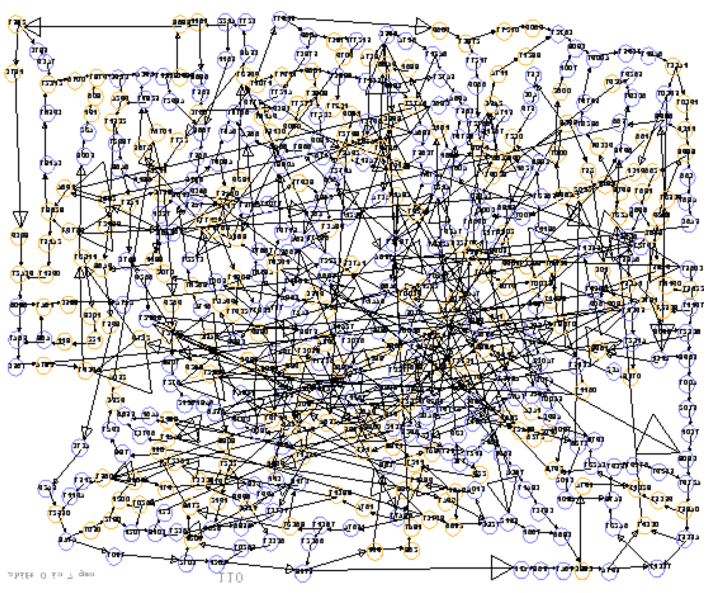
]

---

class: long-slide

# Assembly issues

.pull-left[
*Difficult*:
.small[
* Parallelisation is non-trivial.
* Non-linear complexity.
  + Each read is compared to each other read for overlaps.
* non-haploid genomes are troublesome.
]
]
.pull-right[
*Impossible where*:
.small[
* Repeat-length >
  read-length

]
]
.small[
*The following slides have been inspired by Ben Langmead's lecture series, which you can find [here](http://www.langmead-lab.org/teaching-materials/)*
]

---

class: long-slide

## Assembly 1: de-Bruijn graphs

.pull-left[
.baby-bear[
* Pronounced 'D-Brown'
  + .tiny[source unknown, and irrelevant fact]<br><br>
* k-mer based path to infer assembly.<br><br>
* Genome:
  + `a_long_long_long_time`<br><br>
* `k=5`
]
]
.pull-right[
.center[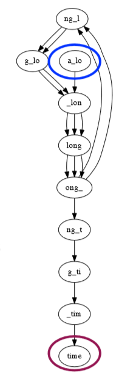]
]

---

class: long-slide

## Assembly 1: De-Bruijn graphs

.pull-left[
.baby-bear[
**Pros**  
Fast! - complexities:
  + Space is `O(N)`
  + Build time is `O(N)`
]
]
.pull-right[
**Cons**  
.baby-bear[
* Can't resolve repeats well.
  + Bound by k-mer size. Always less than read-length.
* Difficulty with read-errors.
  + Exacerbated by PCR-amplification bias.
]]

---

class: long-slide

## Assembly 2: OLC.

.pull-left[
.baby-bear[
1. Build an overlap graph:
  + Locally align prefix of read X to suffix of read Y.
2. Convert overlap stretches into contigs.
3. Run a pileup consensus on the reads mapping to each contig.
]
]
.pull-right[
.center[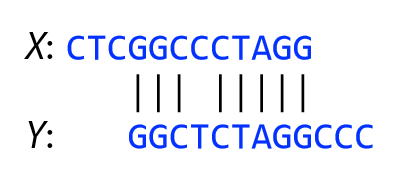]
]

---

class: long-slide

## Assembly 2: OLC.

.pull-left[
**Pros**
1. Less sensitive to sequencing errors.
2. Handles larger repeats
3. Low specificity can reduce bubbles.
]
.pull-right[
**Cons**
1. Overlapping reads is slow.
  + Non-linear time complexity
  + .small[`O(N^2); N=Num reads.`]
2. Low specificity can cause graph errors.
]

---

class: long-slide

# Incomplete assemblies.

.pull-left[
## Useful for:
* Gene quantification.
* SNP detection.
]

.pull-right[
## Work needed:
* Structural annotation.
* Structural translocations.
* Copy number variation.
]

???

Incomplete assemblies aren't completely useless, they can be useful for finding SNPs in a genome along with genome quantification.

---

class: long-slide

# Final Remarks.

.pull-left[
**ONT:**
* Yields improving rapidly
* Error rates an issue.
* Needs focus on sample clean-up
* Bioinformatics needs improvement
]
.pull-right[
**PacBio:**
* Yields need to improve 
  + Yield per ZMW
  + Wells per SMRTCell
* Error rates resolved by greater depth
* Big price-per-base
]

---

class: ont-slide

# Future steps

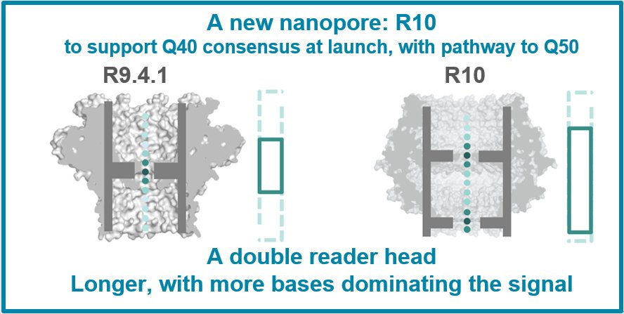

???

Like the rivalry between Microsoft and Apple, two different operating systems with different pros and cons have focused hard on overcoming their cons, essentially resulting in two products which are now close to identical. Nanopore are looking at reinventing the way the way they peform sequencing with their new R10 pore shown in the diagram here. This is expected to place accuracy into the 95-97% range with a reduction in systematic bias in homopolymer areas. Patience may be required before seeing the final result, will need an overhaul in the models used to generate the basecalling.

Targeted sequencing is also coming, using a crispr approach to ligate sequencing adapters onto the end of the target DNA.

---

class: pacbio-slide

# Future steps - PacBio

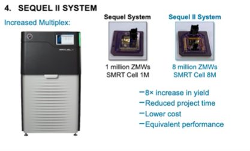

???

PacBio also look forward to beyond the Sequel with the Sequel II, which is expected to see an 8-fold increase in the sequencing throughput holding 8X the number of SMRT cells of the current flowcells.

---

class: linked-slide

# A visual introduction to linked-reads:

.small[Because you can never watch this video too many times]
.center[<a href="https://10xgenomics.wistia.com/medias/2r0nal3n3j">]

???

Things to note:

The GEMs, 14 bp barcodes, and molecular tags.

Add linked reads video here.
https://10xgenomics.wistia.com/medias/2r0nal3n3j

70s in.

---

class: linked-slide

# A Micro-Glossary

* Barcode
  + .small[A unique set of 14 nucleotides.]
* Molecule:
  + .small[The ~50Kb input molecule into the 10X system.]
* Read:
  + .small[~200 bp containing genomic information and a barcode.]
* GEM:
  + .small[A single droplet containing identical barcodes.]
  + .small[Approximately 10 molecules exist inside per GEM.]

---

class: linked-slide

# The Longranger pipeline.

.center[]

???

An important note is that the bcl2fastq stage is separate from the standard illumina bcl2fastq.
The longranger mkfastq is essentially a wrapper aroudn bcl2fastq with a couple of tinkerings.

You then have the option of 'basic, align or wgs from fastq', each with cumulative benefits.
You may wish to use these two on the left for running alternative analysis callers not menitoned today. 

---

## 10x mkfastq
.pull-left[
.baby-bear[
* Wrapper of bcl2fastq
* Input
  + Requires input and output directories
  + A samplesheet
  + A base-mask parameter.
* Output
  + Fastq files split by 10X kit ID .tiny[(SI-GA-01)]
    + Barcode/Index QC Values.
    + GEM estimates
]]
.pull-right[
*  `*_L1.fastq.gz` contains the i7 index
*  `*_R1.fastq.gz` contains the fastq information. <br><br>

]

???


---

class: linked-slide

# BAM Files
```
samtools view align/MG10_output/outs/possorted_bam.bam | head -n1
```  
.small[
```
A00121:44:H5CGNDSXX:3:1636:0:1306618    177     chr1    9990    
20      13S9M1D42M6I24M6I18M6I26M    ATCTCTATCATTATGTCTGTCCATAACCCTAACCCTAACCCTAACCCTAACCCTAACCCTAACCC 
F,F,:,F,,F,,F:,:,F,FFF,FFFFFF:FFFFFFF::FFFFFFFFFFFFFFFF:FFF:FFFFF  
RX:Z:CAAGATCTCCGACGAC   QX:Z:FFFFFFFFFFFFFFFF   BC:Z:GTGGTACC   QT:Z:FFFFFFFF   XS:i:-64        AS:i:-62        XM:Z:0  AM:Z:0  XT:i:0  BX:Z:CAAGATCTCCGACGAC-1  OM:i:20
```
]

---

# Longranger basic
.pull-left[
* Input: 
  + Fastq
* Run time: 
  + A few hours.<br><br>
* Output:
  + unaligned Bam or fastq output.
  + summary.csv file
]
.pull-right[
* BAM TAGS 
  + BX - corrected barcode
  + QX - barcode quality
]

???

---

class: linked-slide

# Longranger align
BWA + 10X Lariat aligner
.pull-left[
.baby-bear[
* Input:
  + Fastq.<br><br>
* Run time:
 + 24 hours.<br><br>
* Output:
 + Aligned BAM
 + Alignment QC stats
]
]
.pull-right[
Output bam tags:
.baby-bear[
* AS - Primary Alignment Score
* XS - Secondary Alignment Score
* To be cont..
]
]

???

Takes about a day, what bam tag outputs are provided.
First pass alignment with BWA.
Second pass with the 10X lariat aligner.
---

class: linked-slide

# Lariat Aligner

Extra alignment help, keeps both primary and secondary alignments alongside information of the GEM tag to:
1. Boost confidence in the alignment score (AM)
2. Use alignments with the same molecular tag to align to  repeat regions (XS)
3. Overcome tandem duplications using GEM tag of secondary alignments (XT)

???

AM tag: Increase the alignment score if the alignment is in a long molecule.
XS: Did the aligner need assistance in flanking regions to align
XT: Mark tandem duplications.

---

class: linked-slide

# Longranger wgs
Obtain SNP calling .small[(GATK)], phasing and SV information

* Input: 
 + Fastq.
* ~ Run time: 
 + Three days .small[w. 250GB RAM and 16 cores]
* Output:
 + .small[List of structural variants in .bed format.]
 + .small[BAM files with additional haplotype phasing tags.]
 + .small[.loupe file.]

???

---

class: linked-slide

# The Loupe file

.pull-left[
~ 5Gb file.  
Contains alignment information across the entire genome.

]
.pull-right[

]

???

Similar to an IGV

---

class: linked-slide

# Linked Reads PMI

.pull-left[
.baby-bear[
* Create great visualisations<br></br>
* Long-range haplotyping<br></br>
* Genome Assembly<br></br>
* Supported bioinformatics<br></br>
]
]
.pull-right[
.baby-bear[
* Restrictions on STRs<br></br>
* Assemblies restricted by repetitive fraction<br></br>
* High quality input material required.<br></br>
]
]

---

## Other interesting things

* [Working with Singularity.](https://alexiswl.github.io/presentations/HPC_and_Singularity/HPC_Singularity_Presentation.html)
* [Working with Vagrant.](https://alexiswl.github.io/presentations/Creating_A_Vagrant_Box/Creating_A_Vagrant_Box.html)
* SMRTLINK On Demand (coming soon) - [email me](mailto: Alexis.Lucattini@agrf.org.au) in the interim and I'll give you a brief on how to set it up on your HPC


???

SMRTLINK On Demand. - coming soon.
Singularity.
Vagrant.

---

## Thank you

.pull-left[
.baby-bear[
* R&D:
    + Kirby Siemering
    + Jafar Jabbari<br></br>
* Lab Ops:
    + Matthew Tinning<br></br>
* IT:
    + Chris Hunt
    + Douglas Morrison
    + Gismon Thomas<br></br>
* Accounts:
    + Desley Pitcher
    + Claire Story
    + Oliver Distler
]
]
.pull-right[
.baby-bear[
* WEHI
    + Steven Wilcox
    + Matthew Ritchie
    + Quentin Gouil
    + Scott Gigante
    + Chris Woodruff
]
]
