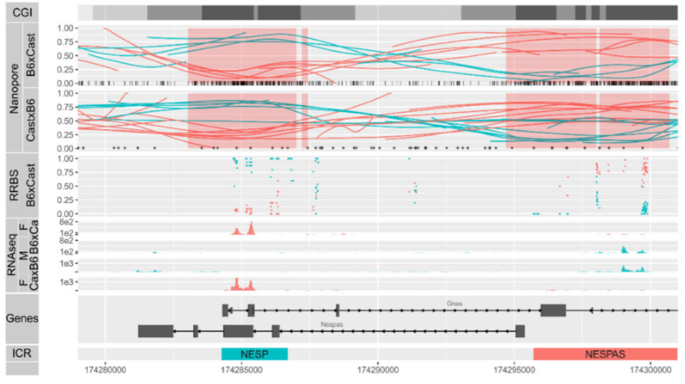

## Beyond Short Reads

.pull-left[
.large[Benefits]
* Long-range haplotyping.
* Methylation with single-molecule level sequencing.
* Scaffolding and genome assembly
* Resolving of large structural variations
]

.pull-right[
.large[Platforms]
* ONT
* PacBio
]

???

Notes:
What are the benefits of long reads.
With short read sequencing, haplotyping information can be conveyed as long as there's no homogeneity for 300 bps. This often means that a SNP on one exon cannot be determined to be linked to a SNP on another exon for a given individual.
Both ONT and PacBio offer single-molecule sequencing, the DNA is not amplified prior to entering the flowcell meaning additional modifications such as methylation can be detected with high coverage.
More commonly long-reads are known for resolving scaffolds for genome assembly. Short-reads simply cannot overcome repeat regions longer than their read-length.

# TODO 
Add ONT and Pacbio image on the columns tag

# ALL TODOS
PACBIO TOOLS -
HOW DOES THE PACBIO WORK?
GENOME ASSEMBLIES
STRUCUTURAL VARIATION TOOLS
ONT AND PACBIO DATASETS
VAGRANT VM

---

class: long-slide

## Bioinformatics is a bottleneck
* Novel file types 
  + multi-fast5s
  + unaligned BAMs

* Many ways to do one thing, benchmarking needed.

* Getting help and resources, community still in development.

* Denovo assemblies have always been really hard.

???

Class: ALL

Notes:

Bioinformatics seems to be a bit of an afterthought.
Raw data off each of the machines comes in a different format, meaning bioinformatics algorithms often need to be built from the ground up.
Denovo assemblies will remain really hard as labs try to complete tasks in the most cost-efficient way.

---

class: long-slide

## New methods for standard tasks
.pull-left[
.baby-bear[
**Basecalling**
* Signal to Base
* Local alignments

**Data QC**
* Read length, yields, read quality
* Fastq *indicitive* of read quality.
]
]
.pull-right[
.baby-bear[
**Adapter trimming**
* Nanopore reads have adapters too.
* PacBio reads can be one sequence repeated many times.

**Alignment**
* Different parameter settings required.
]
]

???

Class: ONT, PacBio

Notes: 

While the standard fastq format is still used, getting to fastqs is not trivial. For ONT, this involves running digital signal data through an RNN to convert into sequencing values. QC values are no longer using interop files or Q30 scores, but we want to look at read length, the yield of the data and the sequencing quality, which can be much more varied when using long-read sequencing platforms.

---

class: long-slide

# Minimap2

* Current gold-standard aligner for ONT and PacBio genomic data.
* Make sure the index is an 'ont-index' or 'pacbio-index' when generating an index file.
* Alignments come with CS-string.

.pull-left[
[GitHub](https://github.com/lh3/minimap2)
]
.pull-right[
[GitHub Guide](https://github.com/lh3/minimap2#users-guide)
]

???

CAN BE BOth PROMETHION AND PACBIO

---

class: long-slide

# The CS tag and MD tag
.pull-left[
.baby-bear[
* CS tag - verbose version of MD tag
  + Easier for parsing.
  + Relatively new.
  + MD tag still required for some parsers.
    + Pipe through `samtools calmd` prior to sorting.
]
]
.pull-right[
.baby-bear[
* CS tag example:
  + `:6-ata:10+gtc:4*at:3`
  + `:[0-9]+ is an identical block`
  + '-[ACTG]+ is a deletion`
  + '+[ACTG]+ is an insersion
  + '*XY' is a substitution with base X subsituted for base y.
]
]

???

Minimap2 is the standard aligner for ONT and PacBio genomic data.
It's extremely fast and has some useful output.

MAYBE TODO Add in slide with minimap2 and nglmr, or put this in the SV slide.

---

class: ont-slide

## Nanopore Sequencing - PMI

.pull-left[
**Technical**
* Very long sequencing reads
* Single-molecule
* Real-time
* Portable
* Low accuracy
* Lower yields
]

.pull-right[
**Financial**
* Minimal start-up cost
* Cheap for small uses of data
* Relatively expensive per base
]

# TODO

Place ONT VIDEO in here

---

class: ont-slide

## Basecalling methods
### GPU & CPU.
* GPUs much faster. .small[Guppy 1.8.3 is the current basecalling version]

* Different algorithms give slightly different results.

* .small[Check out Ryan Wick's [base-calling comparison repo](https://github.com/rrwick/Basecalling-comparison)]

???

Not just the algorithm, but the training data it ahas been exposed to. We often see that the quality of human data to be a bit higher than other data sets.

---

class: ont-slide

## WUB
* Software package repository from ONT.
* Similar to pysam API.
* Handy plotting tools.

.pull-left[
[GitHub](https://www.github.com/nanoporetech/wub)
]
.pull-right[
[Docs](https://wub.readthedocs.io/en/latest/)
]

???

NANOPORE SPECIFIC

---

class: ont-slide

## WUB cont.

.pull-left[

]
.pull-right[

]

???

NANOPORE SPECIFIC

---

class: ont-slide

## NanoPlot

.pull-left[
.baby-bear[
* Plot run metrics for a MinION run
* [Repo on GitHub](https://github.com/wdecoster/NanoPlot)
* Also see 
  + NanoComp
  + NanoStat
  + NanoFilt
  + NanoLyse
]
]

.pull-right[

]

???

NANOPORE SPECIFIC

---

class: ont-slide

## Porechop, Filtlong, Unicycler

Ryan Wick's repos set for:
* [Demultiplexing / Trimming Adapters](https://github.com/rrwick/porechop)
* [Removing poor quality reads](https://github.com/rrwick/filtlong)
* [Generating Circular-hybrid assemblies](https://github.com/rrwick/unicycler)

???

NANOPORE SPECIFIC

---

class: ont-slide

# Nanopolish

Jared T. Simpson's [nanopolish](https://github.com/jts/nanopolish) uses signal-level (fast5) data to:
* Detecting methylation
* Calling SNP level variants
* Polishing genomes

???

NANOPORE SPECIFIC

---

class: ont-slide

# Tombo

**ONT's methylation caller.**

* Provides output of regions of significance
* Can be captured as a 'wiggle' file to be viewed in a genome browser.

.pull-left[
[GitHub](https://github.com/nanoporetech/tombo)
]
.pull-right[
[Docs](https://nanoporetech.github.io/tombo/tutorials.html)
]

???

NANOPORE SPECIFIC

---

class: ont-slide

## Haplotyping-methylation combo

.center[

]

.pull-left[
[BioRxiv Paper](https://www.biorxiv.org/content/early/2018/10/17/445924)
]
.pull-right[
[Scott's GitHub Haplotype-Methylome Repo](https://github.com/scottgigante/haplotyped-methylome)
]

???

NANOPORE SPECIFIC

---

class: ont-slide

## AGRF PromethION in focus

Kit-9, sample sensitive, great N50!

.pull-left[

]
.pull-right[

]

---

class: ont-slide

## Some tutorial references

[Tim Kahlke - Toast 2018](https://github.com/timkahlke/toast2018)  
VM based tutorial. Covers QC to methylation to assembly.

[Hadrien Gourle](https://github.com/HadrienG/tutorials/blob/master/docs/nanopore.md)  
Simple fastq to assembly notebook.

???

These linkes are a little old but the data application is still relevant. File input is now close to multi-fast5s

---

class: pacbio-slide

# Pacific Biosciences

???

Greater maturity in bioinformatics components. Much of what needs to be done can be done via the smrtlink.
Read number restricted by the number of wells - rather than the amount of sequencing. Data comes out as a really large movie that is then converted to unaligned bam files.
Provide estimates of sequencing length and yield from slides. 

# TODO
Need an intro-type 
Add expected yields in here
ADD https://www.youtube.com/watch?v=WMZmG00uhwU&feature=youtu.be to link
Add image https://www.google.com/url?sa=i&rct=j&q=&esrc=s&source=images&cd=&ved=2ahUKEwiMqM-Z5c_iAhVCVH0KHUsACRsQjRx6BAgBEAU&url=https%3A%2F%2Fgithub.com%2Fben-lerch%2FCCS-3.0%2Fblob%2Fmaster%2FREADME.md&psig=AOvVaw1pDeCoQNzBw6_3pbCJqCIc&ust=1559736446254122

---

# Introduction to SMRTLINK

Bioinformatics at a click-of-a-button!
Easy stand-alone workflows that cover much of the capability of the device.
BAM to CSS.
Assembly.
SV Calling
SNP and INDEL calling on long-range amplicons.

???

Our SMRT-LINK runs on a singularity container, an is an on-demand device.
So only running when we need it!
SMRTLINK and its associated command-line version offer scatter-gather algorithms for each of the different services that we offer.

---

# Subread vs CCS Read 

???

The subread contains the smrtbell adapters, converting re-sequenced reads into a concensus single read. 
This increases the accuracy in the read with every additional cycle. Often with genomic DNA, only one cycle is completed. There exists a trade-off between accuracy and length.

Lima is a PacBio developed algorithm for converting subreads into concensus reads.

https://www.google.com/url?sa=i&rct=j&q=&esrc=s&source=images&cd=&ved=2ahUKEwjV6anVoNLiAhWPeisKHayrDEYQjRx6BAgBEAU&url=http%3A%2F%2Ffiles.pacb.com%2Fsoftware%2Fsmrtanalysis%2F2.2.0%2Fdoc%2Fsmrtportal%2Fhelp%2F!SSL!%2FWebhelp%2FPortal_PacBio_Glossary.htm&psig=AOvVaw1PQHML_fwy1Bc8i-c0ekeN&ust=1559821129992274

Or
https://www.google.com/url?sa=i&rct=j&q=&esrc=s&source=images&cd=&ved=2ahUKEwj6st7foNLiAhVTfH0KHbhKCBkQjRx6BAgBEAU&url=http%3A%2F%2Ffiles.pacb.com%2Fsoftware%2Fsmrtanalysis%2F2.2.0%2Fdoc%2Fsmrtportal%2Fhelp%2F!SSL!%2FWebhelp%2FPortal_PacBio_Glossary.htm&psig=AOvVaw1PQHML_fwy1Bc8i-c0ekeN&ust=1559821129992274

---

# PacBio IsoSeq

???

Utilisation of CCS, full-length transcriptome. Goes through many times allowing for full assembly.

# TODO 
Find short read comparison. Exon proportions slide to place in.

---

# SV Calling with PacBio

???

# TODO
Easy work with SMRTLINK but can create your own command as well.
Get a picture of ngmlr vs minimap2.

https://www.pacb.com/products-and-services/analytical-software/whole-genome-sequencing/
https://github.com/fritzsedlazeck/Sniffles

https://github.com/EichlerLab/smrtsv2

---

# Targeted Sequencing with PacBio

???

TODO:
LAA amplicons can resolve haplotyping information and assembly of small important regions. Reducing the cost of sequencing yield whilst also increasing coverage of the important region.

---

# Denovo Assembly

???

#TODO 
Talk about Flye, wtdg2 and then hgap4.
What can be done with the overall layout and consensus, copy from the previous work at nanopore dunedin.
Add in the links completed by Ben Langmead.
Picture of bandage in here. Length L law torsten seeman.

---

# Final Remarks.

???

Not a one-size fits all approach.
Yield vs accuracy trade-off in per-flowcell

---

# Future steps

## ONT - R10 pore, greater accuracy, targeted approach in development

## PacBio - Greater yield, more wells per flowcell.

???

Like the rivalry between Microsoft and Apple, two different operating systems with different pros and cons have focused hard on overcoming their cons, essentially resulting in two products which are now close to identical.

---

# Other things that may interest you

???

SMRTLINK On Demand. - coming soon.
Singularity.
Vagrant.
