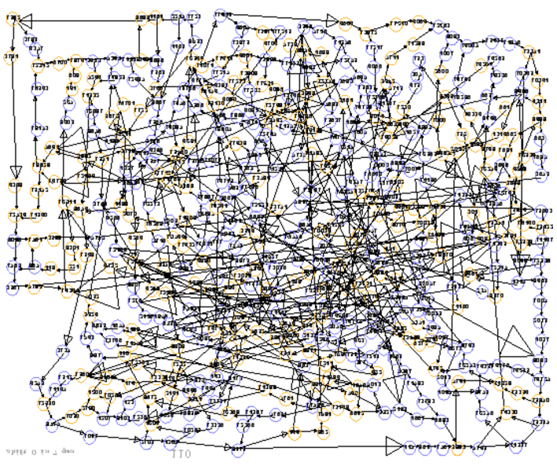
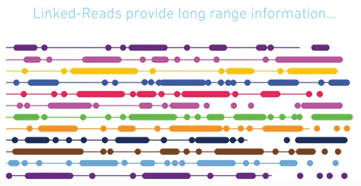

# Nanopore Overview
.pull-left[
.baby-bear[
## Pros:
Ultra-long reads.
Low-cost.
Large Community support
Quick library prep
]
]
.pull-right[
.baby-bear[
## Cons:
Low accuracy.
Low yield.
Systematic bias - homopolymers.
Sample Specific.
]
]

---

# Alignment algorithms
Initially limited, due to unique sequencing error parameters.

.baby-bear[
* LAST was the first best choice.
  + Still very useful for metagenomics.<br><br> 
* Bwa mem with optimised parameters.  
  + -ont2d option equivalent to "-k14 -W20 -r10 -A1 -B1 -O1 -E1 -L0"<br><br> 
* Minimap2 with the map-ont option. 
  + Equivalent to "-k15"
]

---

# Flags and Tags
.small[
Each alignment have set flags and tags. 
This allows you to group reads/alignments based on certain conditions.  
* Flags provide a boolean value for a given condition - True/False.
  + *range: 0-255.*
  + *Boolean combinations for eight attributes.*<br><br> 
* Tags can be optional and hold any type of information.
  + *int, boolean, string*<br><br> 
* Many flags/tags are illumina-sequencing specific:
  + *paired end*
]
---

## Important tags to look at for nanopore sequencing
.pull-left[
.small[
* NM tags
  + The edit distance between alignment and sequence.
* MD tag 
  + Verbose version of the cg tag (CIGAR string) of an alignment
  + Provides SNP/indel information
  + Alignment only - no soft-clip/hard-clip information
  + Insertions are not recorded. Info  [here](https://github.com/vsbuffalo/devnotes/wiki/The-MD-Tag-in-BAM-Files)
]
]

.pull-right[

```{r, echo=FALSE, results='asis'}
library(magrittr)
knitr::kable(data.frame(c("REF ","    ", "READ"),
                        c("TAA-GCAAGGTCG", "|||||||||||||", "CTTGGCA--GTCG")
                        ),
             col.names = NULL, format="html") %>%
  kableExtra::kable_styling(full_width = T, font_size=20) %>%
  kableExtra::column_spec(1:2, monospace=TRUE) 
```
.small[
* A CIGAR string
  + `3M1I3M2D2M4`  
* An MD string equivalent
  + `2MA3^AG4`  
* A CS tag (See next page)
  + `:2*AT+G:3-AG:4`
]
]

---

# The CS tag and MD tag
.pull-left[
.baby-bear[
* CS tag - verbose version of MD tag
  + Easier for parsing.
  + Relatively new.
  + MD tag still required for some parsers.
    + Pipe through `samtools calmd` prior to sorting.
]
]
.pull-right[
.baby-bear[
* CS tag example:
  + `:6-ata:10+gtc:4*at:3`
  + `:[0-9]+ is an identical block`
  + '-[ACTG]+ is a deletion`
  + '+[ACTG]+ is an insersion
  + '*XY' is a substitution with base X subsituted for base y.
]
]
---

# Alignments in Minimap2
.pull-left[
.baby-bear[
* .large[Supplementary alignments]:
  + Definition: A segment of the read which is (mostly) non overlapping the primary alignment that aligns to an alternative position in the genome.
  + Cases:
    * Structural variation.
    * Chimeric reads.<br><br>
]
]
.pull-right[
.baby-bear[
* .large[Secondary alignments]:
  + Definition: A segment of the read which provides an alternative alignment to the primary.
  + Cases:
    * Repeat regions of the genome.
    * Primary alignment may still span both flanks.<br><br>
]
]

---

# Some alignment quirks.
Using pysam, I found a high ratio of discordant to concordant reads.
These supplementary alignments also overlap the primary read.

.center[]

???

# Methylation

What is methylation, current approach to methlyation.

Nanopolish detect methylation.
Tombo - I look forward to trying this.


# Methylation with nanopore sequencing

Benefits, pros cons.

---

# Two main common assembler types:

* de-Bruijn graphs

* OLC - Overlap-layout-concensus


???

http://www.cs.jhu.edu/~langmea/resources/lecture_notes/assembly_dbg.pdf
http://www.cs.jhu.edu/~langmea/resources/lecture_notes/assembly_olc.pdf
http://bioinformatics.org.au/ws14/wp-content/uploads/ws14/sites/5/2014/07/Torsten-Seemann_presentation.pdf

---

# Assembly lingo
.small[
* k-mer:
  + A sequence of length k.<br><br>
* Node:
  + A short sequence or k-mer within the assembly that can be linked to other sequences.<br><br>
* Edges:
  + A link between two sequences that have evidence of overlap.<br><br>
* Graphs:
  + A visual representation of the sequence using edges and nodes.<br><br>
]

---

# Assembly lingo 2

.pull-left[
* Contig:
  .small[
  + An unambiguous* contiguous assembled sequence of the genome.
  ]<br><br>
* Scaffold:
  .small[
  + A collection of contigs with known orientation.
  ]
]
.pull-right[
.center[
        
]
.tiny[Image credit [Torsten Seeman](http://bioinformatics.org.au/ws14/wp-content/uploads/ws14/sites/5/2014/07/Torsten-Seemann_presentation.pdf)]
]


---

# Expectations vs Realities
.center[

]

---

# Assembly issues

.pull-left[
*Difficult*:
.small[
* Parallelisation is non-trivial.
* Non-linear complexity.
  + Each read is compared to each other read for overlaps.
* non-haploid genomes are troublesome.
]
]
.pull-right[
*Impossible where*:
.small[
* Repeat-length >
  read-length

]
]
.small[
*The following slides have been inspired by Ben Langmead's lecture series, which you can find [here](http://www.langmead-lab.org/teaching-materials/)*
]

---

### Assembly Approach 1: De-Bruijn graphs

.pull-left[
.small[
* Pronounced 'D-Brown'
  + .tiny[source unknown, and irrelevant fact]<br><br>
* k-mer based path to infer assembly.<br><br>
* Genome:
  + `a_long_long_long_time`<br><br>
* `k=5`
]
]
.pull-right[
.center[]
]

---

### Assembly Approach 1: De-Bruijn graphs

.pull-left[
.baby-bear[
**Pros**  
Fast! - complexities:
  + Space is `O(N)`
  + Build time is `O(N)`
]
]
.pull-right[
**Cons**  
.baby-bear[
* Can't resolve repeats well.
  + Bound by k-mer size. Always less than read-length.
* Difficulty with read-errors.
  + Exacerbated by PCR-amplification bias.
]]

---

## Assembly Approach 2: OLC.

.pull-left[
.baby-bear[
1. Build an overlap graph:
  + Locally align prefix of read X to suffix of read Y.
2. Convert overlap stretches into contigs.
3. Run a pileup concensus on the reads mapping to each contig.
]
]
.pull-right[
.center[]
]

---

## Assembly Approach 2: OLC.

.pull-left[
**Pros**
1. Less sensitive to sequencing errors.
2. Handles larger repeats
3. Low specificity can bubbles.
]
.pull-right[
**Cons**
1. Overlapping reads is slow.
  + Non-linear time complexity
  + `O(N^2); N=Num reads.`
2. Low specificity can cause graph errors.
]

---

# Incomplete assemblies.

.pull-left[
## Useful for:
* Gene quantification.
* SNP detection.
]

.pull-right[
## Work needed:
* Structural annotation.
* Structural translocations.
* Copy number variation.
]

---

## Assembly with long-read sequencing.

Long read platforms: .tiny[That I'm familiar with] 
 + 10X Chromium.
 
 + PacBio.
 
 + Nanopore.

---

## PacBio Circular Consensus sequencing.

.pull-left[
.baby-bear[
* Increases accuracy.  
* Minimal sequencing bias.  
* Insert length != Subread length.  
* Gold standard for de novo assemblies.
  + But expensive cost-per-base.
]
]

.pull-right[
.center[]
]
---

# 10X Chromium.
.pull-left[
.baby-bear[
* Illumina level accuracy<br><br>
* Supernova optimised for human genomes<br><br>
* Shortfall on highly repetitive genome sequences.<br><br>
* Some regions - long stetches of short tandem  repeats still unsolvable.<br><br>
]
]
.pull-right[
.center[]
]
---

## Nanopore sequencing .small[for large genomes.]
.pull-left[
## Pros
.baby-bear[
* Low capital cost.
* Ultra-long reads can scaffold Illumina sequences.
]
]
.pull-right[
## Cons
.baby-bear[
* Low accuracy requires lower alignment stringency => greater cpu-hours.
* Systematic bias provides issues with genomic assemblies.
* Best with hybrid approach.
]
]

---

# Real-world np assemblers

## Miniasm

Fast and dirty - OLC.
Little concensus done.

## Canu

Forked from Celera assembler - OLC.
CPU heavy - Human Genome ~ 60'000 cpu hours!

---

# A hybrid approach!

Unicycler:
.baby-bear[
* illumina-only 
  + **SPAdes** + custom overlap trimming & bridging

* de-novo 
  + **miniasm** + **racon** polishing

* hybrid 
  + **miniasm** + **racon** on anchor contigs + bridging.
]

---

# The PromethION!

Kit-9, sample sensitive, great N50!

.pull-left[

]
.pull-right[

]

---

class: genomics-innovation-hub, gih-slide-number

# Hub Goals

* Building innovation ecosystems.
* Stepping up to the innovation challenge.
* Providing access to state-of-the-art technologies
* Managing cost efficiency

.pull-right[
Contact: <a href="mailto:azadeh.seidi@agrf.org.au">Azadeh Saedi</a>
.kinda-small[Website: <a href="https://genomicsinnovationhub.org.au">GenomicsInnovationHub.org.au</a>]]


???

* Building innovation ecosystems: 
    + through common research, collaboration, education and technology development.
* Stepping up to the innovation challenge: 
    + bringing resources together to diffuse cutting-edge genomic technologies.
* Providing access to state-of-the-art technologies: 
    + access to Australia's first 10X Genomics Chromium system, as well as early access to cutting-edge technologies such as the Oxford Nanopore Technologies PromethION.
* Managing cost efficiency: 
    + open access to a portfolio of cutting-edge technologies and competencies.

---

# Thank yous.
.pull-left[
.baby-bear[
* R&D:
    + Azadeh Saedi
    + Ken McGrath
    + Kirby Siemering
    + Lavinia Gordon
* Lab Ops:
    + Matthew Tinning
* IT:
    + Chris Hunt
    + Douglas Morrison
    + Gismon Thomas
* PR:
    + Desley Pitcher
]
]
.pull-right[
.baby-bear[
* WEHI
    + Matthew Ritchie
    + Quentin Gouil
    + Scott Gigante
    + Chris Woodruff
]
]